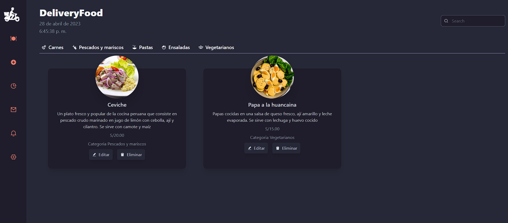
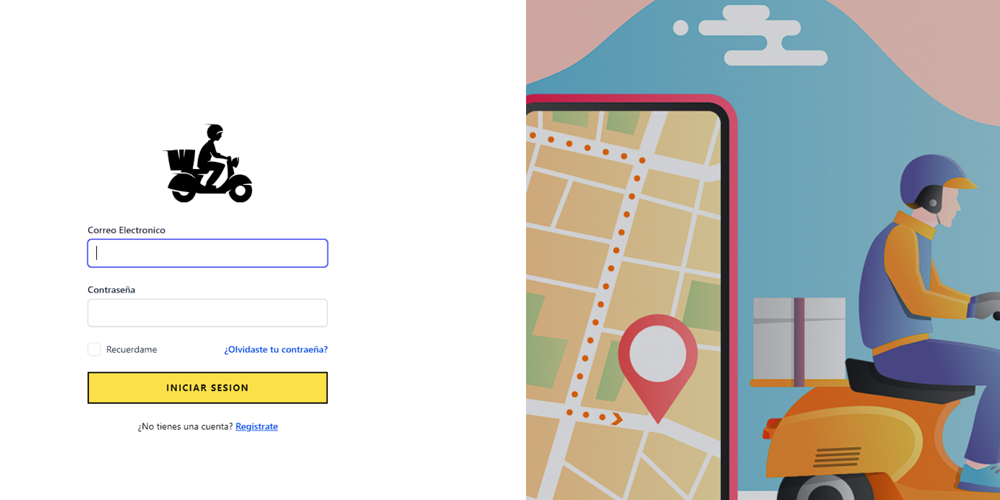

# System Restaurant Delivery

## Comenzando 🚀

_Este sistema web permite gestionar un restaurante de delivery completo, desde la recepción de pedidos hasta la gestión de los repartidores asi como inventario de productos._

### Instalación 🔧

Instalar dependencias de backend y frontend

```
composer install
npm install
```

Linkear recursos estaticos de laravel y correr migraciones con seeders

```
php artisan storage:link
php artisan migrate --seed
```

configurar las variables de entorno para la base de datos

```
DB_CONNECTION=mysql
DB_HOST=127.0.0.1
DB_PORT=3306
DB_DATABASE=system-restaurant-delivery
DB_USERNAME=root
DB_PASSWORD=****
```

## Construido con 🛠️

- [Laravel](http://www.dropwizard.io/1.0.2/docs/) - Framework de php
- [React](https://maven.apache.org/) - Framework para el frontend
- [InertiaJS](https://rometools.github.io/rome/) - Usado para conectar backend y frontend
- [TailwindCSS](https://rometools.github.io/rome/) - Clases de utilidad CSS

## Autor ✒️

- **Royer Rutti Ramos** - [WizardRRR](https://github.com/WizardRRR)

<div align="center">
  </img>
  <br/>
  <br/>
  </img>
</div>
